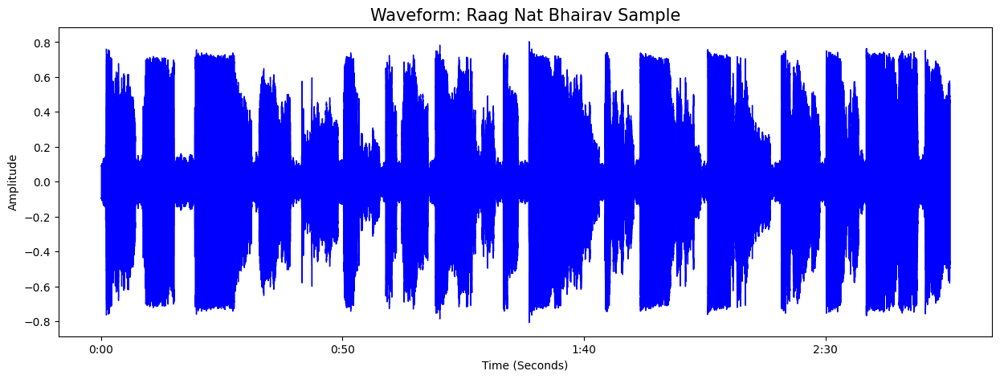

Principal Researcher:[LinkedIn Profile](https://www.linkedin.com/in/vishalmpa/)
# Audio Analysis of Raga Nat Bhairav
**Project Objective:** Computational mapping of Indian Classical Music structures for Research in Musopathy & Digital Health.

## 🛠️ Technical Stack
* **Language:** Python
* **Library:** Librosa (Audio Signal Processing), Matplotlib (Visualization), NumPy
* **Method:** Short-time Fourier Transform (STFT)

## 📊 Visual Analysis
### 1. Spectrogram Analysis
Analyzing frequency components and tonal nuances of Raga Nat Bhairav.

### 2. Waveform Mapping
Visualizing the amplitude and temporal structure of the vocal recording.

## 🎯 Research Significance
This project bridges the gap between **Indian Knowledge Systems (IKS)** and **Data Science**, exploring how acoustic features can be used in music therapy and sound-based healing.

---
References: "I have used open-source libraries: Librosa, NumPy, and Matplotlib. Audio samples used for analysis are for academic research purposes only."

-----------------------------------------------------------------------------------------------------------------------------------------
Data Attribution:

Vocal Recording: Pt. Arindam Bhattacharyya
Dataset Curation & Signal Processing: Vishal

-----------------------------------------------------------------------------------------------------------------------------------------
